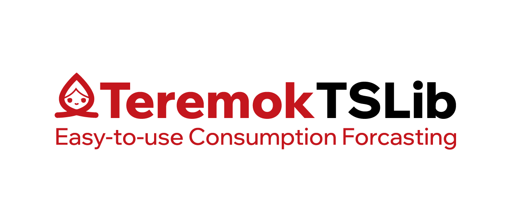

# What is this Library about?
Easy-to-use (4 lines of code, actually) framework for training powerful predictive models!

# Description
We made a mother-model, which consists of multiple layers of predictive models: ewma is used as trend, Prophet is used for getting seasonality, CatBoost is used for predicting residuals.
Why did we do that? Because we needed a out-of-the-box solution, which could be used by non-ML users. 

# How-to-install?
You can install this framework via pypi: 
```
pip install TeremokTSLib
```

# How-to-use?
You can watch an example in TeremokTSLib/tests foulder. All you need is dataframe with 2 columns: date, consumption.
Then you can initiate mother-model and train it with just 2 rows of code:
```
import TeremokTSLib as tts
model = tts.Model()
model.train(data=data)
```

# Maintained by
Library is developed and being maintained by Teremok ML team

# Contacts
- Our website: https://teremok.ru/
- ML team: you can contact us via telegram channel @pivo_txt